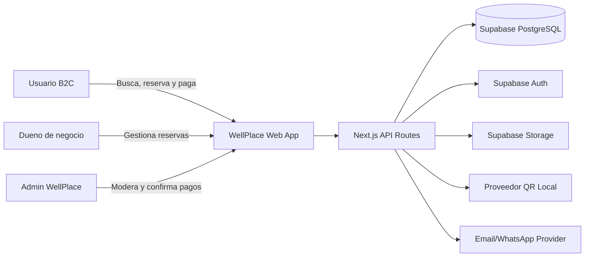
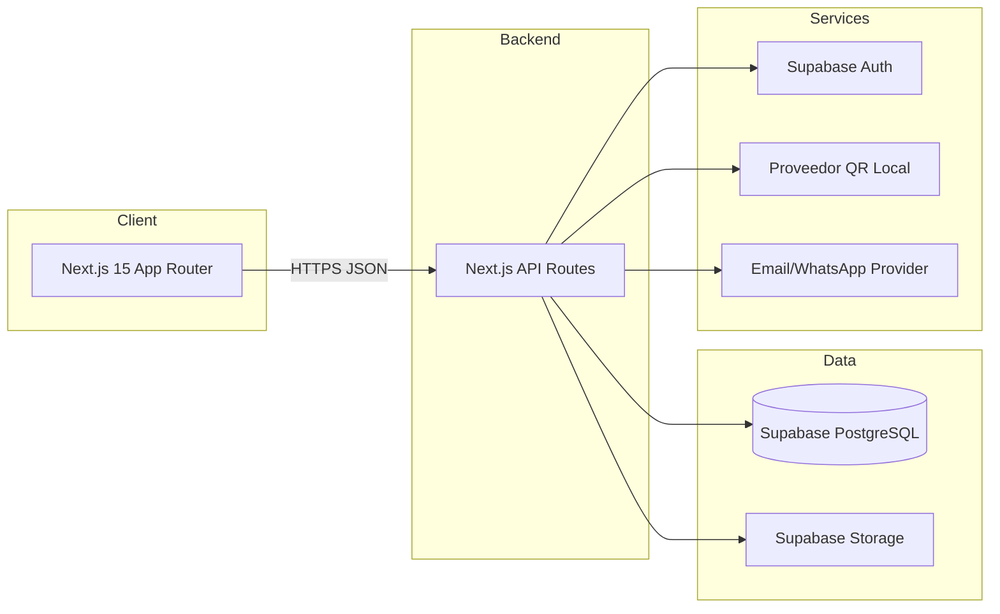
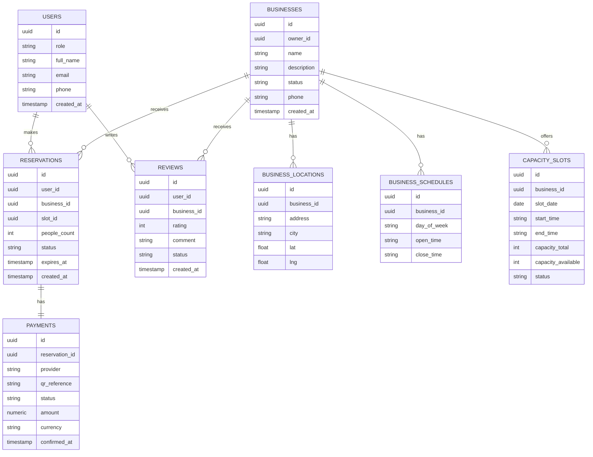
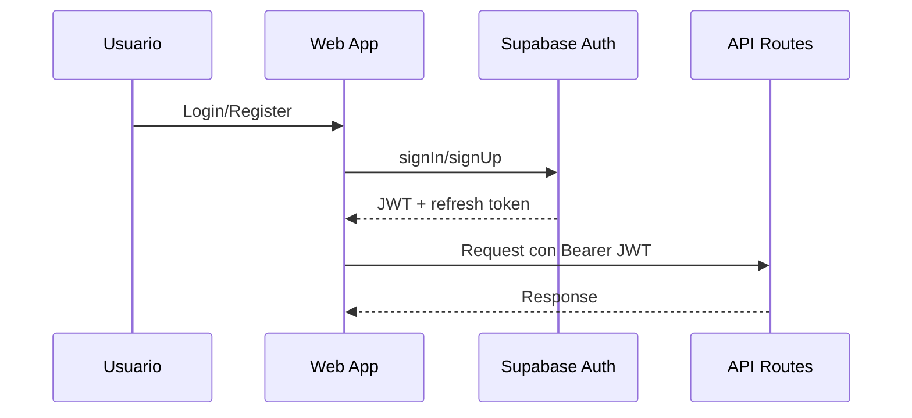

# Architecture Specifications - WellPlace

## 1. System Architecture (C4 Level 1)

## 2. System Architecture (C4 Level 2 - Containers)

## 3. Database Design (ERD en Mermaid)

> Nota: No se define SQL estatico. El esquema real se obtiene via Supabase MCP.

## 4. Tech Stack Justification

- Frontend: Next.js 15 (App Router)
  - ✅ Full-stack framework con routing y SSR
  - ✅ RSC para performance en busquedas
  - ❌ Curva de aprendizaje App Router

- Backend: Next.js API Routes
  - ✅ Reusa la misma base de codigo
  - ✅ Despliegue simplificado en Vercel
  - ❌ Limite de ejecuciones largas

- Database: Supabase PostgreSQL
  - ✅ SQL robusto y RLS por negocio
  - ✅ Auth y Storage integrados
  - ❌ Dependencia de proveedor unico

- Hosting: Vercel
  - ✅ Edge Network para contenido estatico
  - ✅ Integracion CI/CD simple
  - ❌ Costos variables en alto trafico

- CI/CD: GitHub Actions
  - ✅ Automatizacion de tests y despliegues
  - ✅ Integracion nativa con repo
  - ❌ Mantenimiento de pipelines

## 5. Data Flow (Reserva con pago QR)

1. Usuario selecciona negocio, fecha, horario y personas.
2. Frontend valida input (Zod) y envia POST /api/reservations.
3. API valida disponibilidad y crea reserva pending_payment.
4. API bloquea cupo en capacity_slots.
5. Frontend solicita POST /api/payments/qr.
6. API crea pago pending y obtiene QR del proveedor local.
7. Usuario paga via app bancaria y el sistema espera confirmacion.
8. Confirmacion manual/automatica actualiza pago a confirmed.
9. Reserva cambia a confirmed y se notifica al usuario.

## 6. Security Architecture

### Auth Flow Diagram

### RBAC Implementation

- Roles: user, business_owner, admin.
- Policies en Supabase RLS por business_id y user_id.
- Endpoints admin protegidos con middleware.

### Data Protection

- Encriptacion en transito (TLS 1.3).
- Sanitizacion de inputs y validaciones Zod.
- Auditoria de confirmaciones manuales de pago.

## 7. Riesgos Tecnicos y Legales

- Confirmacion manual de pagos puede generar errores humanos y disputas; requiere auditoria y controles RBAC estrictos.
- Concurrencia en reservas puede causar double booking si no se usan transacciones/locks.
- Proveedor QR local puede no ofrecer webhooks estables; el flujo de confirmacion puede degradar UX.
- Reglas de pago locales pueden exigir comprobantes y retencion de datos; validar normativa en ciudad piloto.
